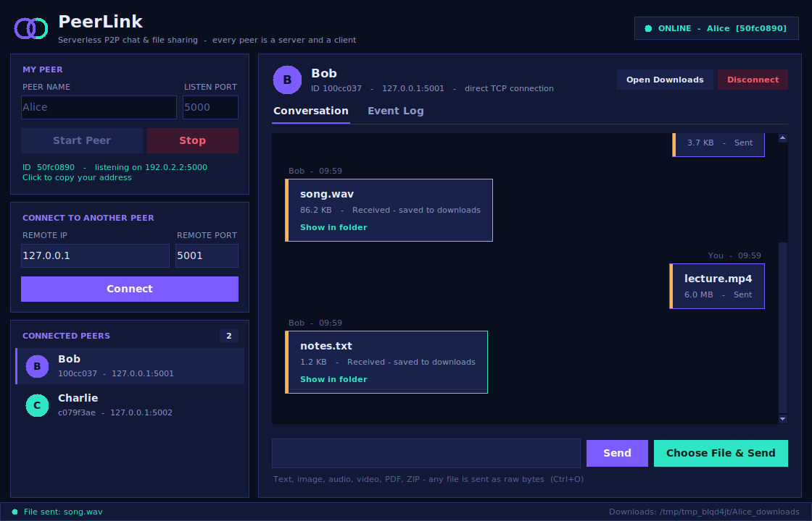
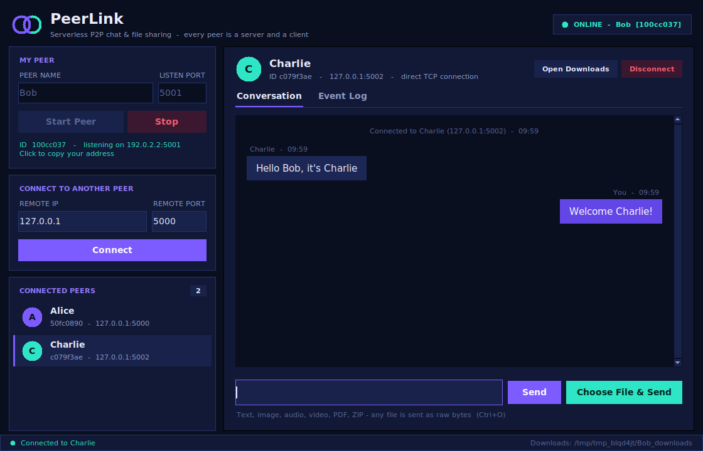
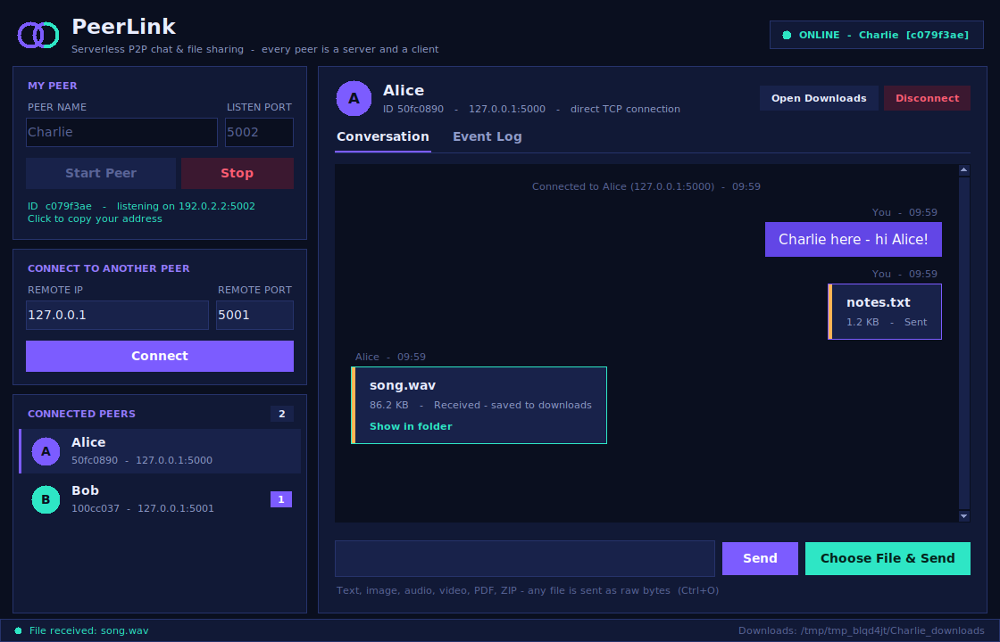
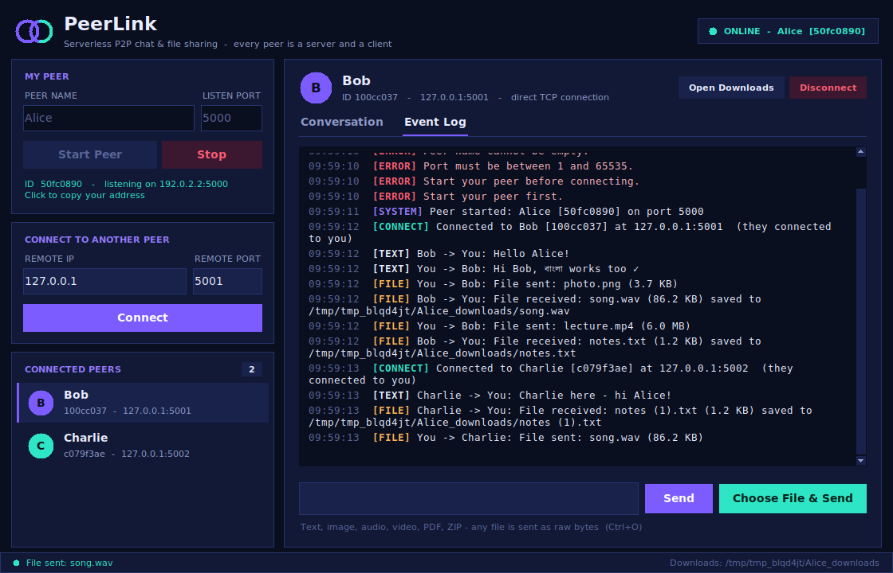
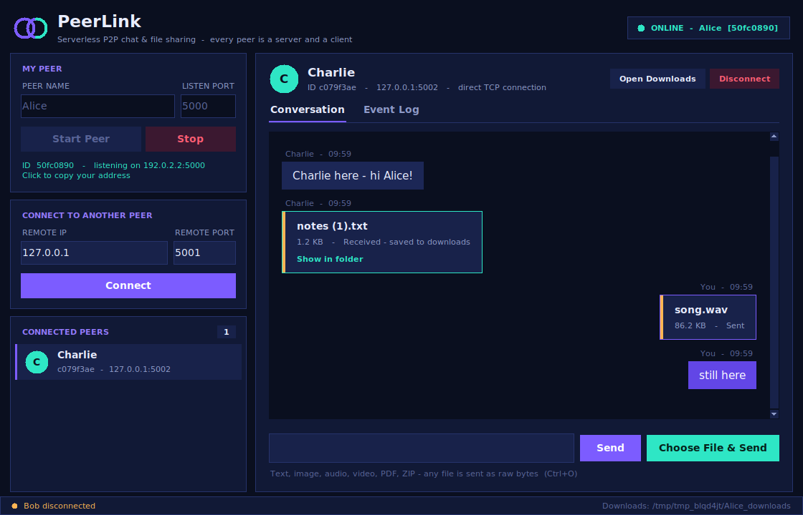

# PeerLink - Peer-to-Peer Chat & File Sharing

**CSE 433 - Blockchain & Distributed Security Lab - University of Asia Pacific**
Programming Assignment: *Peer-to-Peer Network Communication and File Sharing*

PeerLink is a lightweight peer-to-peer network written in pure Python. Every running
copy of the program is **both a TCP server and a TCP client**, so any number of students
can connect directly to one another and exchange **text messages** and **files of any type**
(images, audio, video, PDF, ZIP, ...) with **no central server**.



---

## Features

| Area | What PeerLink does |
|------|--------------------|
| P2P model | Each peer runs a listening TCP server *and* dials out as a client |
| Handshake | `hello` / `hello_ack` exchange of peer id, name and listening port |
| Messaging | Direct text chat with any connected peer (Unicode safe) |
| File transfer | Metadata first, then raw bytes in 64 KiB chunks - files never loaded fully into RAM |
| Multi-peer | One reader thread + one writer thread per connection; any number of peers |
| Framing | `[4-byte length][JSON]` so TCP message boundaries are never lost |
| Safety | Filename sanitising, no overwrites, `.part` files, size/length limits, handshake timeout |
| Errors | Invalid IP/port, refused connection, timeouts, disconnects, missing files - all shown, never a crash |
| GUI | Dark "Nebula" Tkinter interface: peer cards, chat bubbles, live progress bar, event log |

## Requirements

* **Python 3.9 or newer**
* **No third-party packages** - only the standard library (`socket`, `threading`, `json`, `struct`, `tkinter`, ...)
* Tkinter (ships with Python on Windows/macOS). Linux: `sudo apt install python3-tk`
* Windows, Linux or macOS

## Installation

```bash
# 1. unzip the project and open a terminal inside the folder
cd P2P_Network

# 2. (nothing to pip install)  - optional: check your Python version
python --version
```

## How to run

```bash
python main.py
```

Optional convenience flags (useful when you demo three peers on one PC):

```bash
python main.py --name Alice   --port 5000 --start
python main.py --name Bob     --port 5001 --start
python main.py --name Charlie --port 5002 --start
```

## How to connect two peers

**On one computer (Test 1)**

1. Open two terminals and run `python main.py` in each.
2. Peer A: name `Alice`, port `5000` -> **Start Peer**.
3. Peer B: name `Bob`, port `5001` -> **Start Peer**.
4. In Bob's window under *Connect to Another Peer* enter IP `127.0.0.1`, port `5000` -> **Connect**.
5. Both windows now list the other peer (with its 8-character id) and open a conversation.

**On two computers (Test 2)** - both machines on the same Wi-Fi / LAN

1. On Computer A, press **Start Peer**. The sidebar shows your LAN address, e.g. `192.168.1.10:5000`
   (click it to copy). You can also find it with `ipconfig` (Windows) or `ip a` / `ifconfig` (Linux/macOS).
2. On Computer B, enter `192.168.1.10` and `5000` -> **Connect**.
3. If it times out, allow Python through the firewall (Windows: *Allow an app* -> Python) or
   temporarily allow the port.

**Three or more peers (Test 3)** - start Alice, Bob and Charlie, then connect
Bob -> Alice, Charlie -> Alice and Charlie -> Bob. Select a peer in the *Connected Peers* list to
chat with that peer; each peer has its own conversation.



## How to transfer files

1. Select the receiving peer in the **Connected Peers** list.
2. Click **Choose File & Send** (or press `Ctrl+O`) and pick any file.
3. A progress bar shows speed and percentage on both sides.
4. The receiver finds the file in the **`downloads/`** folder (use **Open Downloads** or
   **Show in folder**). If a file with the same name exists it is saved as `photo (1).jpg` - nothing is overwritten.



The **Event Log** tab keeps a timestamped record of every connection, message, file and error:



## Error handling

| Situation | What the user sees |
|-----------|--------------------|
| Empty name / invalid port | `Port must be a whole number between 1 and 65535.` |
| Invalid IP address (`999.1.1.1`) | `'999.1.1.1' is not a valid IPv4 address.` |
| Port already used | `Port 5000 is already in use. Choose a different port.` |
| Peer not running | `Connection failed: Connection refused (...)` |
| Unreachable peer | `Connection failed: Connection timed out (...)` |
| Connect to yourself / twice | `A peer cannot connect to itself` / `Already connected to Bob` |
| Peer disconnects (even mid-file) | Peer removed, partial file deleted, other peers keep working |
| Send with no peer selected | `Select a connected peer first.` |
| File missing / unreadable | `File does not exist: ...` |
| Invalid file size in metadata | Only that connection is closed; everything else continues |



## Project structure

```
P2P_Network/
├── main.py              # entry point (python main.py)
├── gui.py               # Tkinter user interface - no networking code
├── p2p_node.py          # PeerNode: server + client, threads, handshake, text, files
├── protocol.py          # message framing, message types, receive helpers
├── utils.py             # validation, filename safety, formatting, LAN address
├── requirements.txt     # (stdlib only)
├── README.md
├── downloads/           # received files are stored here
├── docs/
│   ├── ARCHITECTURE.md  # layers, threading model, wire protocol, sequence diagrams
│   └── VIVA_GUIDE.md    # answers to the 20 viva questions + code map
├── screenshots/         # images used in this README
└── tests/
    ├── test_protocol.py # framing + validation unit tests
    ├── test_node.py     # real-socket integration tests (text, files, multi-peer, errors)
    └── gui_smoke.py     # drives three GUI windows end to end
```

| File | Responsibility |
|------|----------------|
| `main.py` | Starts Tkinter and the `App` |
| `gui.py` | Everything visual; talks to `PeerNode` only through method calls and an event queue |
| `p2p_node.py` | Every peer = TCP server + TCP client: accept loop, dialing, handshake, reader/writer threads |
| `protocol.py` | `[4-byte length][JSON]` framing, `recv_exact`, message builders, streamed file receive |
| `utils.py` | Input validation, safe filenames, human-readable sizes, local IP, open-folder |

## Protocol in one minute

```
Peer B (initiator)                         Peer A (acceptor)
      |------- TCP connect() ---------------->|  accept()
      |-- {"type":"hello", id, name, port} -->|
      |<-- {"type":"hello_ack", id, name, port}|        <- handshake done
      |-- [len]{"type":"text", "message":...} ->|        text message
      |-- [len]{"type":"file","filename","filesize":N}->|  metadata
      |-- N raw bytes (64 KiB chunks) -------->|        file body, exactly N bytes
```

Details and diagrams: [`docs/ARCHITECTURE.md`](docs/ARCHITECTURE.md).

## Running the tests

```bash
python -m unittest discover -s tests -v          # 44 tests: framing, handshake, text, files, multi-peer, errors
python tests/gui_smoke.py                        # drives 3 GUI windows (needs a display)
python tests/gui_smoke.py --screenshots          # also regenerates ./screenshots (needs Pillow)
```

The integration tests transfer random binary files (empty, 1 byte, exactly one chunk, one chunk + 1 byte,
7 MB "video"), compare SHA-256 hashes, build a 3-peer mesh, attach 8 peers to one hub, drop peers
mid-transfer, and send malicious filenames - all against real TCP sockets.

## Assignment requirement checklist

| Requirement (section) | Where |
|-----------------------|-------|
| 7.1 Peer startup with name + port | `gui.start_peer`, `PeerNode.start` |
| 7.2 Connect by IP + port | `gui.connect_clicked`, `PeerNode.connect_to_peer` |
| 7.3 Connected peer list (name + id) | sidebar *Connected Peers* |
| 7.4 Text messaging, no server | `PeerNode.send_text`, `_on_text` |
| 7.5 File transfer of any binary file | `PeerNode._transmit_file`, `_receive_file` |
| 7.6 Received files stored locally | `downloads/` |
| 10.3 HELLO handshake | `PeerNode._handle_incoming`, `_connect_worker` |
| 10.4 Threads per connection | reader + writer thread per `PeerConnection` |
| 10.5 Message types hello / hello_ack / text / file | `protocol.py` |
| 10.6 `[4-byte length][JSON]` framing | `protocol.encode_message`, `recv_message` |
| 10.9 64 KiB chunks | `protocol.FILE_CHUNK_SIZE` |
| 12 GUI (all 12 elements) | `gui.py` |
| 14 Error handling | see table above, `tests/test_node.py` |
