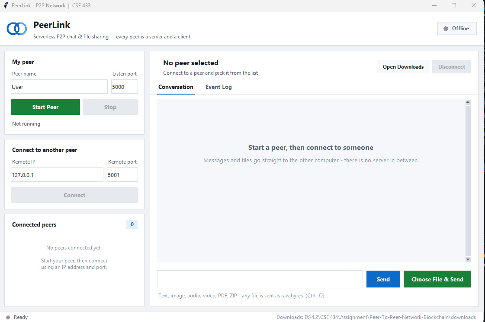
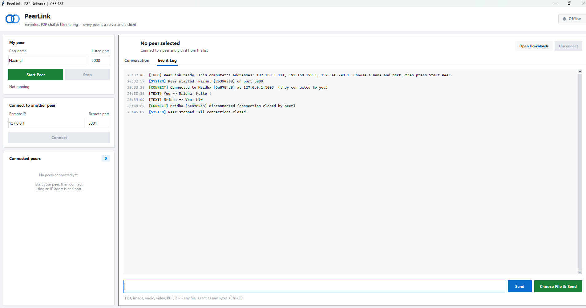
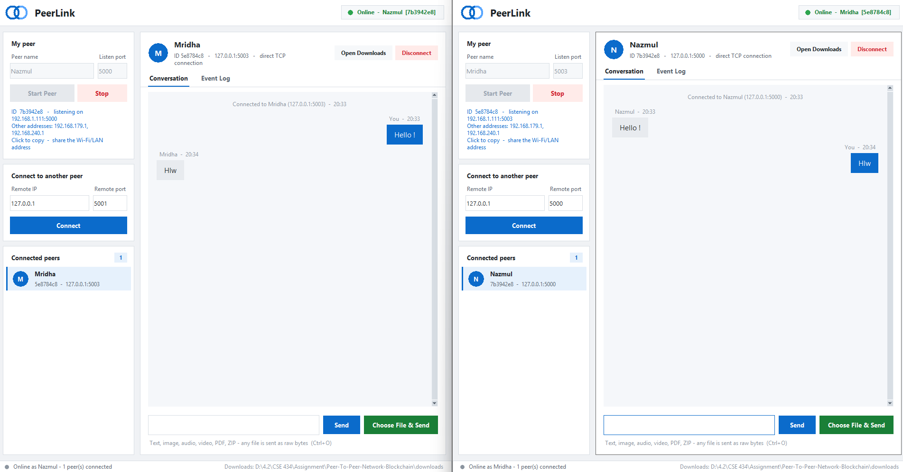
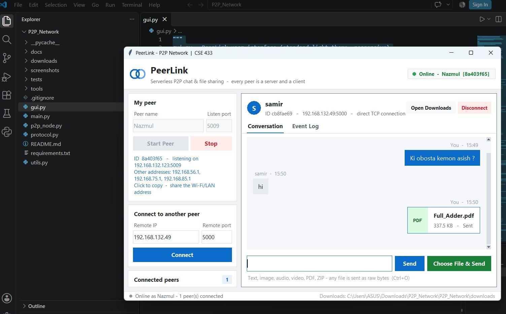

# PeerLink – Peer-to-Peer Chat & File Sharing

**CSE 433 – Blockchain & Distributed Security Lab**

PeerLink is a serverless peer-to-peer application written in pure Python. Every running copy is both a TCP **server** and a **client**, so peers connect directly using an IP address and port, and exchange **text messages** and **files of any type** (image, audio, video, PDF, ZIP, …) with no central server in between.

---

## Features

- Each peer listens for connections *and* dials out to others
- Direct text chat with any connected peer
- File transfer in raw bytes (streamed in 64 KiB chunks)
- Multiple peers at once, with a separate conversation per peer
- Event log of connections, messages, files and errors
- Clear error messages (invalid IP/port, refused connection, disconnects)
- Tkinter GUI – standard library only, no `pip install` needed

## Requirements

- Python 3.9+
- Tkinter (bundled with Python on Windows/macOS; on Linux: `sudo apt install python3-tk`)

## Run

```bash
python main.py
```

Optional flags: `python main.py --name Alice --port 5000 --start`

## How to use

1. Enter a **peer name** and **listening port**, then click **Start Peer**.
2. On another peer (same PC or same Wi-Fi/LAN), enter the first peer's **IP** and **port** and click **Connect**.
3. Select the peer in **Connected peers** to chat.
4. Click **Choose File & Send** (`Ctrl+O`) to send a file. Received files are saved in the `downloads/` folder.

---

## Screenshots

### 1. Home screen
Start a peer, then connect to someone using their IP and port.



### 2. Event log
Timestamped record of connections, messages and system events.



### 3. Two peers chatting
Two peers connected on one computer (`127.0.0.1`), exchanging messages directly.



### 4. Chat and file sharing over LAN
Two different computers connected over Wi-Fi/LAN, chatting and sending a PDF.



---

## Project structure

```
├── main.py          # entry point
├── gui.py           # Tkinter user interface
├── p2p_node.py      # peer logic: server + client, handshake, text, files
├── protocol.py      # message framing ([4-byte length][JSON]) and message types
├── utils.py         # validation, safe filenames, helpers
├── requirements.txt # standard library only
├── screenshots/     # images used in this README
└── downloads/       # received files are stored here
```
